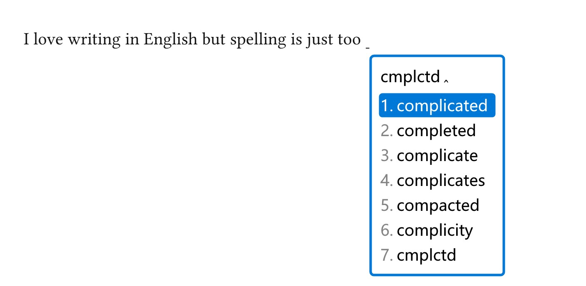

# Spellless

**Stop spelling. Start writing.**



You know the word. You have always known the word. What you cannot reliably do
at the speed you think is get its letters into the right order — and English
charges you for that, hour after hour, and gives you nothing back.

Spellless takes your approximate spelling and offers you the word you meant.
Drop the vowels. Get the letters out of order. Run two words together. Then
glance, pick, and keep going.

```
recieve          →  receive              teh            →  the
recommnedation   →  recommendation       cmplctd        →  complicated
mthmtcs          →  mathematics          dffmrphsm      →  diffeomorphism
strtfctn         →  stratification       grthndck       →  Grothendieck
exactlyright     →  exactly right        thisday        →  this day
mther's          →  mother's             mthers'        →  mothers'
bc               →  because              im             →  I'm
```

**Nothing is ever corrected behind your back.** The list appears, you choose,
and `Enter` always commits exactly what you typed. It never quietly decides you
meant something else — because the one thing worse than mistyping a word is a
machine mistyping it for you, confidently, while you look away.

## Why this should exist

Chinese input methods solved a version of this decades ago. You type an
approximation, the IME shows you candidates, you pick one. Hundreds of millions
of people write that way every day and nobody finds it remarkable.

English never got the same treatment, because typing English assumes you can
spell it. So spelling stays a tax on thinking — a hundred small stumbles an
hour, each one pulling your attention off the sentence and onto the keyboard.

### Why not autocorrect?

Autocorrect has to choose. It gets one guess, it has no way to say *I am not
sure*, and it applies its guess to text you have already written. When it is
right you never notice; when it is wrong you often do not notice either, which
is the entire problem. You find out when a reader does. The keystroke it saved
was never the expensive part — the expensive part is that you can no longer
trust the sentence without re-reading it.

A candidate list moves the decision to the only party who knows which word was
meant. That is not a smaller version of autocorrect. It is the opposite
arrangement: the machine proposes, you dispose, and nothing lands that you did
not choose.

It also makes far more ambition affordable. Autocorrect can only risk a
near-miss of an edit or two, because every guess is applied unseen. Spellless
can offer `mathematics` for `mthmtcs`, because a consonant skeleton is not a
typo of anything — it is an abbreviation, and accepting it means allowing a
distance so large that half the dictionary becomes reachable. That is
unthinkable if a machine must pick, and perfectly safe when a human is looking
at seven options.

And it never fights you. Autocorrect's whole job is to overrule what you typed,
so it overrules `kubectl`, `argmax`, `Grothendieck` and every name it has not
met. Here what you typed is always on the list, `Enter` always commits it
verbatim, and a word Spellless does not know will not go in at all until you
press space a second time.

Spellless treats what you typed as **a noisy encoding of a word you already
know**, and decodes it:

* **A transposition is nearly free.** `teh` is `the`. Your fingers arrived out
  of order, which says almost nothing about what you meant.
* **Vowels are cheap. Consonants carry the word.** `mthmtcs` is `mathematics`
  and `dffmrphsm` is `diffeomorphism`, because English spelling is largely
  redundant and the consonant skeleton is where the information lives.
* **Everything competes on one score** — frequency, edit cost, how much a
  completion adds, what you have chosen before — so a common word reached by a
  cheap slip can legitimately beat a rare exact prefix.

Look again at the screenshot. `complicated` is first, and `completed`,
`complicate`, `compacted`, `complicity` are the words a reasonable reader might
have suspected. That is a ranking, not a lookup: nothing under `rime/lua/`
knows any of those words. They fall out of a weighted edit distance, a
consonant-skeleton index and one ranking function. See [DESIGN.md](DESIGN.md).

## What it feels like

You stop proofreading mid-sentence. You stop backspacing four characters to fix
a transposition. Spaces appear between words and never in front of a comma; the
first word of a sentence arrives capitalised; `eg` becomes `e.g.`, `english`
becomes `English`, `i` becomes `I`. You type a colleague's name once and it is
remembered. You get a word wrong that Spellless has never seen, and the space
bar *declines to commit it* until you press it a second time — because the one
moment worth interrupting you is the moment you were about to be wrong.

And when it does get something wrong, one key makes it forget.

```
mathe            →  mathematics · mathematical · mathematician …
dont             →  don't          its       →  its · it's
youre            →  you're         id        →  id · I'd
noether's        →  Noether's      psdfnctr  →  pseudofunctor
```

**The word you meant is first 88.3% of the time, and on the first page 98.4%.**
About 2 ms per keystroke over 83,095 words. 1844 assertions say it still
behaves. [EVALUATION.md](EVALUATION.md) has the numbers, including the cases it
gets wrong and why.

---

## Requirements

* **Windows 11 with [Weasel](https://github.com/rime/weasel) 0.16 or newer.**
  Lua support is already there: official librime release builds bundle
  `librime-lua`, and Weasel ships those builds. Nothing to install, no plugin
  to compile, no administrator rights.
* **Python 3.8+** to run the installer (and only for that). No third-party
  packages; PyYAML is used if present, to double-check an edit before it is
  written, and skipped if not.

### What has and has not been verified

The matcher, the ranking and the Rime adapter are exercised by 1774 assertions
under a real Lua 5.4 (`make test`), including `tests/test_adapter.lua`, which
drives `rime/lua/spellless.lua` against a stand-in for librime-lua built from
its actual API (`tests/rime_mock.lua`). The schema and the librime behaviour it
relies on — `express_editor` binding Return to *commit raw input*, the
`recognizer` accepting characters outside the speller's alphabet, `"schema_list/+"`
appending rather than replacing — were checked against librime's source, and
the installer's directory detection was dry-run against a live Weasel 0.17.4 /
librime 1.13.1 install with rime-ice.

What has **not** happened is a keystroke going through Weasel itself: that
needs a Windows session. If something misbehaves on first deploy, the candidate
comments (`spellless/show_debug_comments: true`) and `%APPDATA%\Rime\rime.log`
are the two places to look.

---

## Install

Everything below works on a stock [Weasel](https://github.com/rime/weasel), and
installs into your Rime user directory without touching anything else.

One optional feature needs a patched frontend. `reclaim_space` lets punctuation
take back the space after a word you already committed, so pressing space and
then `.` gives `you. ` rather than `you . `. That needs
[spellless-weasel](https://github.com/EricWay1024/spellless-weasel) — a build
of Weasel that installs *beside* your existing one, with its own GUIDs, pipe,
registry key and user directory, so a Chinese input method already installed
carries on untouched. It is GPL-3.0, like Weasel; this repository is MIT.

From Windows:

```powershell
python scripts\install.py
```

From WSL (the installer finds the Windows-side directory itself):

```bash
python3 scripts/install.py
```

Then:

1. Right-click the Weasel tray icon → **Deploy** (「重新部署」).
2. Press <kbd>F4</kbd> (or <kbd>Ctrl</kbd>+<kbd>`</kbd>) and choose
   **Spellless**.

Useful flags:

| Flag | |
| --- | --- |
| `--dry-run` | print every action, change nothing |
| `--list-candidates` | show which Rime user directories were considered, and why |
| `--user-dir DIR` | install somewhere specific |
| `--no-enable` | copy the files but leave `default.custom.yaml` alone |
| `--uninstall` | remove the files this script wrote |

The installer only ever writes inside your Rime user directory. It appends one
entry to `default.custom.yaml` using Rime's list-append operator
(`"schema_list/+"`), which **adds** to the schema list from `default.yaml`
rather than replacing it — important if you run a distribution like rime-ice.
The file is backed up first, only ever has lines inserted so your comments
survive, and if it already patches `schema_list` the installer prints what to
add rather than guessing.

### The files it deploys

```
<rime user dir>/
├── spellless.schema.yaml
├── lua/spellless.lua
├── lua/spellless/{config,corpus,distance,engine,generate,rank,skeleton,userdb,util}.lua
└── spellless/{spellless.words,spellless.weights,spellless.alpha,spellless.skel,spellless.build.json}
```

Nothing else is touched. In particular `rime.lua` is never written: only one
`rime.lua` is ever loaded, so overwriting it would break other Lua schemas.

---

## Using it

| Key | |
| --- | --- |
| <kbd>1</kbd>…<kbd>7</kbd> | select a candidate |
| <kbd>Space</kbd> | commit the highlighted candidate |
| <kbd>Enter</kbd> | **commit exactly what you typed** |
| <kbd>Esc</kbd> | cancel the composition |
| <kbd>−</kbd> / <kbd>=</kbd>, <kbd>,</kbd> / <kbd>.</kbd>, <kbd>PgUp</kbd> / <kbd>PgDn</kbd> | page through candidates |
| <kbd>Shift</kbd> (tapped on its own) | leave Spellless and type straight through; tap again to come back |
| <kbd>Ctrl</kbd>+<kbd>Shift</kbd>+<kbd>A</kbd> | the same, deliberately — also commits the word first |
| <kbd>F4</kbd> | schema menu |

**Tap Shift to get out of the way.** It switches to plain typing, and tapping it
again switches back — the tray icon shows which mode you are in. Tapped
mid-word it commits exactly what you had typed, literally, and then switches,
so it doubles as the escape hatch when a word is clearly not going to be found.
That is the answer for LaTeX, shell commands and anything with digits in it:
`\citep{Hat02}` is a Shift tap away, rather than something the matcher has to
be taught.

This is safe while typing capitals. librime only toggles on a *bare*
press-and-release: any other key in between cancels it, and it must be released
within 500 ms, so <kbd>Shift</kbd>+<kbd>M</kbd> can never flip the mode. If you
still manage to trip it, set `Shift_L`/`Shift_R` to `noop` in
`spellless.schema.yaml`.

**Spaces are automatic**, and they ride on the word: whichever key commits it —
space bar, a number — puts the space in too. Typing punctuation instead ends
the word *without* its space and puts one after the punctuation, so

```
hello  wrold.     →  Hello world.
you.   thats      →  You. That's
```

Nothing ever has to be un-typed. Turn it off with
`spellless/auto_space: false`.

**Sentences start with a capital.** After `.`, `!`, `?`, on a new line, and at
the start of an empty text box, candidates lead with a capital — but only if
you typed the word in lower case, so `MATHE` and `kubectl` are left alone. Turn
it off with `spellless/auto_capitalize: false`.

**Dropped apostrophes are treated as typography, not spelling**, so `dont`
gives `don't`, `youre` gives `you're`, and `its` gives `its` first with `it's`
right behind it. A bare `i` gives `I`, and `eg` gives `e.g.` — the dots would
otherwise end the composition, and committing the abbreviation whole is also
what stops it being mistaken for the end of a sentence. Add your own in
`data/forms.txt`.

**Short and capitalised input leads with itself.** `x`, `f`, `cm`, `ms`, `CW`,
`PDE`, `TQFT` commit as themselves, because one or two characters are variables
and units far more often than the start of a longer word, and typing an acronym
in capitals is deliberate. A real word still means itself (`i`, `an`, `eg`), and
a one-letter completion of a short stem is still trusted (`th` → `the`).

**Possessives are productive**: `noether's` → `Noether's`, `cat's` → `cat's`,
and a name you taught it once works too — commit `Awodey`, and `awodey's` gives
`Awodey's`.

**The literal text you typed is always on the first page** — in slot 7 by
default, or first when nothing plausible was found, so pressing space on
`kubectl` or `argmax` cannot turn it into an English word.

**Capitals work.** `Mathe` gives `Mathematics`, `RECIEVE` gives `RECEIVE`.

**snake_case identifiers** (`foo_bar`, `max_iter2`) are taken literally as soon
as the underscore appears. Digits are *not* treated that way, because the
number keys select candidates — see Limitations.

---

## Your own vocabulary

Two ways, and you probably want both.

**Learned automatically.** Every word you commit is counted in
`<rime user dir>/spellless_user.txt`, and words you pick often rise. It stores
*how* you wrote a word only when the dictionary cannot already explain it —
`MacLane`, `TQFT`, a surname — so a capital that came from the start of a
sentence is never mistaken for a preference. Committing the plain lowercase
form takes a stored spelling back. A word the
dictionary has never heard of becomes a candidate as soon as you commit it
once — commit `Grothendieck` by pressing Enter, and afterwards `grthndck` gives
it back, capitals and all. This is the answer for tool and package names:
commit `pytest` once and `pytst` finds it thereafter.

**Written by hand.** That same file is plain text and safe to edit:

```
# word <TAB> count
# word <TAB> how you write it <TAB> count
perverse	5
grothendieck	Grothendieck	12
Hausdorff
```

A one-column entry written with capitals is its own spelling, so `Hausdorff`
above needs no second column.

For a larger, permanent vocabulary, add a `.txt` file to `data/vocab/` and
rebuild — this puts the words in the main dictionary with a real corpus
frequency rather than in your personal history. An entry written with capitals
(`Grothendieck`, `TQFT`) is indexed lowercase and remembers its spelling, so
only write capitals where the lowercase form would be wrong.
`data/vocab/math_sample.txt` ships around 300 words of pure mathematics and its
working vocabulary; it is a sample, not something the matcher knows about.

---

## Capitals, place names and phrases

Words that are only ever written with a capital — `English`, `Mexico`,
`Thursday`, `Oxford`, and given names like `Eric` — live in
`data/vocab/proper_nouns.txt` and `data/vocab/given_names.txt` and commit that way
however you type them. The bar for adding one is that the lowercase spelling is
wrong in *every* context, which is why `March`, `May`, `Polish` and `Turkey` are
deliberately absent: each is an ordinary word too, and listing it would put the
ordinary word out of reach.

`data/vocab/phrases.txt` holds word groups that behave as one word when typed:

```
in front of      ->  type "infrontof"
each other       ->  type "eachother"
Hong Kong        ->  type "hongkong"
with respect to  ->  type "withrespectto"
```

The lookup key is the letters alone and the entry commits as written, spaces
included. They are ordinary dictionary entries, so fuzzy matching applies —
`hngkng` finds `Hong Kong`. Typing the words separately still works exactly as
before; this is an addition, not a replacement.

Both files rebuild the dictionary (`make`). A file may open with `#!rank N` to
say how common its words are; without it every supplemental word arrives at
rank 20,000, which is far too prominent for a list of place names.

---

## Words run together

```
exactlyright      ->  exactly right
helloworld        ->  hello world
iamgoingtoschool  ->  I am going to school
asamatteroffact   ->  as a matter of fact
```

Two words is what one asks for, but two is the special case: finding the best
way to cut a string into dictionary words is a word-break dynamic program, so
any number of words falls out of it. Each part keeps its own spelling, which is
why the pronoun comes back capitalised.

Two rules keep it from running wild, because almost any long string can be cut
up somehow:

* **A word is never split.** `another` segments perfectly into `a not her`, and
  `together` into `to get her`. If the dictionary has the string, it is a word.
  Only the dictionary counts, not your own history: a word committed once is a
  record of something typed, quite possibly the very run-together this fixes.
* **A split is placed, not ranked.** It goes last among the real candidates,
  with the literal after it as usual. It is worth having and never worth
  preferring, and no score says that: scored high it displaced real
  corrections, and suppressed whenever anything else fitted it vanished exactly
  when it was wanted — `thisday` offered `Thursday`, `Tuesday`, and no way at
  all to say `this day`.

So `spellless` and `argmax` keep the first slot, `receive` still leads for
`recieve`, and `this day` is there when you want it.

Not done: matching a run-together that is *also* misspelled, so `exctlyrght`
would find `exactly right`. Each part would need the full fuzzy search, at
every split point, which is a different order of cost from a dictionary lookup.

---

## Possessives

Type the apostrophe and the whole list comes back possessive:

```
mther's   ->  mother's      milnor's   ->  Milnor's
mthers'   ->  mothers'      students'  ->  students'
```

The stem is matched fuzzily — that is the part you might misspell — and the
ending you typed is put back untouched. Which ending is right depends on
whether the noun is plural, and the apostrophe you placed already says so, so
the matcher does not guess at it.

Nothing guesses a possessive from a bare `s`: `teachers`, `students` and
`mothers` are ordinary plurals far more often, and offering `teacher's` under
every plural would be wrong nearly every time.

---

## Your own abbreviations

`spellless_shortcuts.txt`, in the same directory:

```
bc      because
ppl     people
btw     by the way
```

An exact match on the left puts the text on the right at the top, ahead of
everything the matcher inferred; the expansion is free text, so several words
are fine, and `#` starts a comment. Redeploy after editing.

You will need fewer of these than you expect. The matcher already rebuilds a
word from its consonants, so `mthmtcs` finds `mathematics` and `ppl` would find
`people` unaided. What a list is for is the cases where the information is not
in the input at all: `bc` is two letters, and at two letters almost every word
in the language is a plausible completion, which is why the skeleton sources
stay quiet there (`min_skeleton_completion_len`). No tuning fixes that. It is a
habit, and a habit has to be written down.

---

## Configuration

Anything in `rime/lua/spellless/config.lua` can be overridden per schema. Edit
`spellless.custom.yaml` in your Rime user directory:

```yaml
patch:
  # put the literal input first, always
  spellless/raw_candidate_index: 1
  # mark it, so it is obvious which one it is
  spellless/raw_comment: "literal"
  # show where every candidate came from and what it scored
  spellless/show_debug_comments: true
  # stop learning
  spellless/learn: false
  # type your own spaces and capitals
  spellless/auto_space: false
  spellless/auto_capitalize: false
  # only on the Spellless build of Weasel: let punctuation take back the space
  # after a word you already committed, so "you " + "." is "you. "
  spellless/reclaim_space: true
  # a bigger candidate window (the literal-input slot follows page_size)
  menu/page_size: 9
```

Redeploy afterwards.

---

## Rebuilding

```bash
make            # dictionary + indexes + test set
make test       # 1774 assertions
make bench      # accuracy and latency over tests/cases/
make install
```

or, without `make`:

```bash
python3 scripts/build_dictionary.py     # generated/spellless.words, .weights
python3 scripts/build_indexes.py        # generated/spellless.alpha, .skel
python3 scripts/make_testset.py         # tests/cases/generated_*.tsv
lua tests/run.lua
python3 tests/test_install.py
lua bench/evaluate.lua
```

Every generated file is byte-for-byte reproducible from `data/`, and
`generated/spellless.build.json` records the sources, their SHA-256 sums and
the parameters used. The manifest also records the build time, so set
`SOURCE_DATE_EPOCH` if you want that reproducible too. `install.py` refuses to
copy a `generated/` whose parts disagree with each other. Sources and licences: [data/README.md](data/README.md).

The tests and benchmark need a `lua` binary (5.4). They exercise exactly the
modules Rime loads — the matching core is plain Lua with no Rime dependency.

---

## Layout

```
spellless/
├── DESIGN.md              architecture, and why each decision went that way
├── EVALUATION.md          accuracy and latency, and how to reproduce them
├── docs/spellless.jpg     the screenshot at the top
├── rime/
│   ├── spellless.schema.yaml
│   └── lua/
│       ├── spellless.lua          Rime adapter + the Return processor
│       └── spellless/             the matcher, no Rime dependency
│           ├── config.lua         every tunable number, in one place
│           ├── corpus.lua         dictionary + the two index permutations
│           ├── distance.lua       weighted Damerau-Levenshtein, banded
│           ├── generate.lua       candidate generation: exact/prefix/typo/skeleton
│           ├── rank.lua           the single additive score
│           ├── skeleton.lua       the consonant-skeleton rule
│           ├── preceding.lua      what the text behind the cursor implies
│           ├── userdb.lua         personal vocabulary and learning
│           ├── engine.lua         orchestration, capitalisation, literal input
│           └── util.lua
├── scripts/               dictionary build, index build, test-set build, installer
├── data/                  vendored corpus, supplemental vocabulary, surface forms
├── generated/             build output (1.3 MB) — what gets deployed
├── tests/                 1774 assertions + the evaluation cases
└── bench/                 evaluate.lua, tune.lua, naive.lua
```

---

## Limitations

Found while building this, not guessed at.

1. **Digits end a word.** The number keys select candidates, and Rime's
   recognizer runs *before* the selector — so any pattern that let `Lean4`
   compose as one token would swallow the `2` in `Mathe2` and break candidate
   selection after every capitalised word. Digits therefore commit the current
   word: type `Lean`, press Enter or a candidate key, then `4`. Underscores are
   fine (`foo_bar`), and so is a second capital (`TQFT2`, `ArXiv2`), because
   neither can be confused with prose. `spellless.schema.yaml` documents a
   looser one-capital pattern you can swap in if you write far more identifiers
   than prose. For a run of them, tap Shift.
2. **Rime cannot retract committed text**, so every spacing rule has to avoid
   writing a space rather than remove one. (`key_binder`'s `send:`
   re-processes a key inside the engine and drops it if nothing handles it — a
   synthetic Backspace never reaches the application.) Two consequences:
   *commit a word with the space bar or a number key and then type
   punctuation* gives `mathew .`, because the word's space was already
   written; and a run like `...` gives `. . .`. Typing the punctuation while
   the word is still being composed — the normal way — is right. So is
   deleting the odd stray space.

   The frontend is not bound by this, and the Spellless build of Weasel lifts
   it: set `spellless/reclaim_space: true` and punctuation takes that space
   back. See DESIGN §5.6 and
   [EricWay1024/spellless-weasel](https://github.com/EricWay1024/spellless-weasel).
   It stays off on a stock install, where the request would be typed in
   literally.
3. **No space goes in front of opening punctuation**, so `Let $X$` needs the
   space after `Let` typed by hand. Adding one before `(`, `[` and `$` would
   turn `f(x)` into `f (x)`; the two are indistinguishable from inside the IME,
   so Spellless does not guess.
4. **No multi-word input.** One composition is one word. `mthmtcs s hrd`
   requires three commits. Rime's `octagram` (bundled) would give sentence
   context, but that needs a real dictionary-backed translator; see *Next*.
5. **No word-boundary splitting.** Typing `newyork` will not offer
   `new york`.
6. **Learning remembers the word, not the input that found it.** Selecting
   `recommendation` for `rcmmndtn` raises `recommendation` everywhere; it does
   not remember that *this* abbreviation meant *that* word. Storing the pair
   would be a small change to `userdb.lua` and is still the highest-value next
   step.
7. **Proper nouns from the corpus can crowd short prefixes.** The frequency
   list is Google-Books-derived, so `mathe` offers `mathew` above
   `mathematics`. Better data, or a name-demotion pass at build time, would fix
   it; nothing in the algorithm needs to change.
8. **First-letter errors are only partly covered.** The scan is anchored on the
   query's first *or second* letter, so `nirth`→`north` works but a query whose
   first letter is a wrong key and whose second is also wrong will miss.
   `spellless/scan_first_neighbours: true` widens this at roughly double the
   scan cost.
9. **Very short input is genuinely ambiguous** and the ranking does not
   pretend otherwise: `frm` offers `from`, `form`, `firm`, `farm`, `forum`,
   `frame` in frequency order. One and two characters go further and lead with
   the literal, so `cm` stays `cm` — which means a two-letter abbreviation like
   `im` costs one extra keystroke to reach `I'm`.
10. **Typing latency is Lua-bound.** About 1.7 ms per keystroke while typing an
   ordinary word, 8 ms at the 95th percentile across the whole evaluation set,
   with a ceiling on how many candidates are examined. It is comfortably
   interactive, but there is no headroom for, say, a 500k-word dictionary
   without a different index.
11. **Spacing and capitals infer the surrounding text, and can be wrong.** Rime
   clears its commit history on Return and Backspace and records spaces you
   type yourself, and Spellless notes which of Return/Backspace happened, so
   the common cases are right. But a mouse click that moves the caret is
   invisible to the IME, and an abbreviation you type dot by dot is
   indistinguishable from a full stop — so you will occasionally get a stray
   space or capital. (`e.g.` and `i.e.` are in `data/forms.txt`, so committing
   them from `eg`/`ie` is recognised and does not start a sentence.)
   Backspace re-syncs it (it marks "not a sentence start"), and
   `spellless/auto_space` / `spellless/auto_capitalize` turn either off.
12. **Capitalisation comes from three places, none of them the corpus.** The
   frequency list is lowercase throughout, so capitals come from how you typed
   the word, from `data/forms.txt` and capitalised `data/vocab/` entries
   (`Grothendieck`, `TQFT`), or from what you have committed before. A name in
   none of those still comes out lowercase until you commit it once.
13. **The first composition after a deploy pays about 100 ms** to load the
    dictionary. Once per process, not once per word.

---

## Next improvements, in order of expected impact

1. **Remember the input, not just the word.** Store `(typed, committed)` pairs
   in `spellless_user.txt` and score an exact match on the typed form very
   highly. This makes every correction you make once permanent, and directly
   fixes limitation 4. Small, contained change to `userdb.lua` and `rank.lua`.
2. **A better frequency list.** The Google-Books-derived corpus over-weights
   archaic words and proper nouns (limitation 5). Blending in a modern
   subtitle/web corpus, or demoting capitalised-in-corpus tokens at build time,
   would improve the top-1 rate more than any further weight tuning.
3. **Score candidates against previously committed text.** `Context` exposes
   `commit_history`; using the previous word as a bigram context would
   disambiguate `frm`-class inputs, which is where the remaining top-1 losses
   are concentrated. `librime-octagram` is bundled and could supply the model.
4. **Learn the cost profile from data.** The edit weights were tuned by
   coordinate descent over ~1000 cases; fitting them to a real keystroke log
   (yours) would do better, and `bench/tune.lua` already provides the loop.
5. **Word-boundary splitting** for run-together input (limitation 3). A dynamic
   program over the prefix index, offered as a lower-ranked candidate class.
6. **Incremental search.** Consecutive keystrokes re-search from scratch;
   restricting the next scan to the previous candidate set plus one edit would
   cut typical latency several-fold.
7. **Case-aware dictionary entries** so `NASA` and `Frobenius` carry their own
   capitalisation instead of being reconstructed from the input pattern.

---

## Licence and data

Code: MIT. Dictionary: derived from the SymSpell frequency dictionary (MIT);
see [data/README.md](data/README.md) for provenance, preprocessing and counts.
